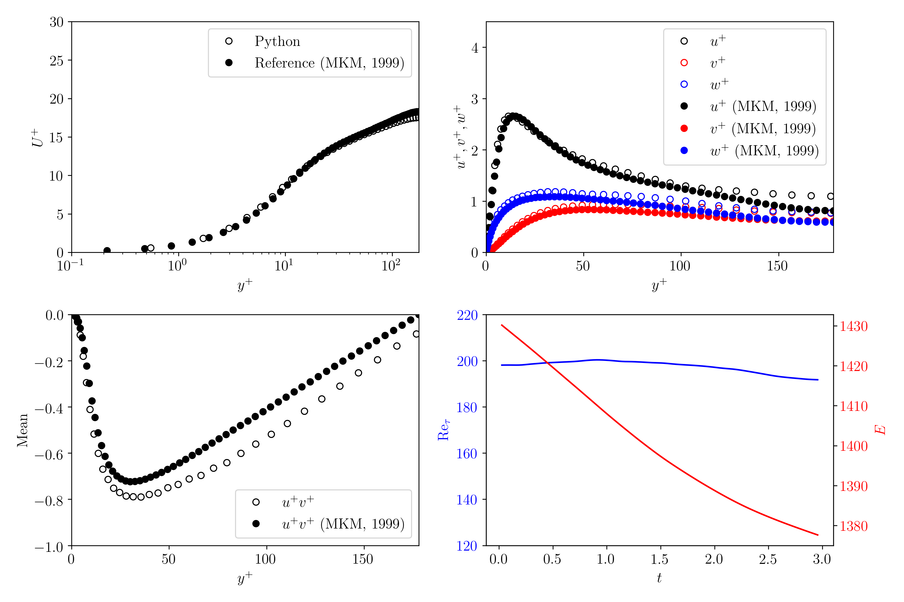

# Channel_Flow
This repository contains the codes for three-dimensional direct numerical simulation (DNS) of wall bounded turbulent channel flow at $Re_\tau=180$. This code is based on the [DNSLab](https://reader.elsevier.com/reader/sd/pii/S0010465516300388?token=DEF9C0CD15B33C1678C961844FA695EA663017C505C58C7CEBF3705597D2B02EFCDDB4125607969EBFEDE0FB9D05E9D5&originRegion=us-east-1&originCreation=20211211172633) solver in Matlab.

Validation of the finiite-difference solver in capturing the statistics of the turbulent channel flow

Streamwise velocity in different orienttion planes for turbulent channel flow

